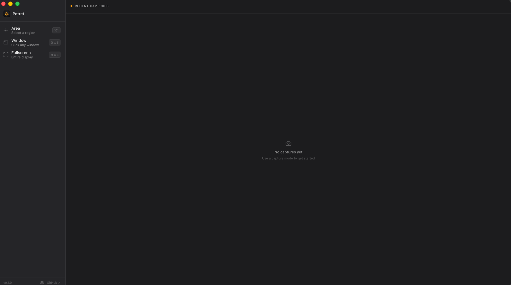

<div align="center">
  
  <h1>Potret</h1>
  <p><strong>A free, open-source screenshot & annotation tool for macOS.</strong></p>
  <p>Inspired by CleanShot X — without the price tag.</p>
</div>

---

Potret lives in your menu bar. Take a screenshot and a floating **Quick Access** panel appears so you can copy, save, annotate, pin, drag it out, or drop it onto a beautiful background — without opening a heavy editor.

## Download

1. Grab the latest `.dmg` from the [**Releases**](https://github.com/PradiptaPutra/potret/releases/latest) page (universal — runs on **Apple Silicon and Intel**).
2. Open it and drag **Potret** into **Applications**, then **eject** the disk image (⏏ next to "Potret" in Finder's sidebar).

> ### ⚠️ First launch — required one-time step
> Potret isn't notarized by Apple yet (that needs a paid developer account), so on first open macOS blocks it with *"Apple could not verify Potret is free of malware."* This is expected for open-source apps. Pick whichever is easier:
>
> **Easiest — Terminal (one command):**
> ```bash
> xattr -dr com.apple.quarantine /Applications/Potret.app
> ```
> then open Potret normally.
>
> **No Terminal:** double-click Potret (it gets blocked → click **Done**), then go to
> **System Settings → Privacy & Security**, scroll down to *"Potret was blocked…"* and click **Open Anyway**.
>
> After it opens, grant **Screen Recording** permission (System Settings → Privacy & Security → Screen Recording) and restart the app.

**Uninstall:** drag **Potret** from Applications to the Trash.

Prefer to build it yourself (no Gatekeeper prompt)? See [Development](#getting-started) below.

## Screenshots

<div align="center">
  
</div>

<!--
  More shots to add (capture them with Potret itself) — drop into docs/ and uncomment:
<div align="center">
  <br/>
  <br/>
  
</div>
-->

## Features

- **Capture** — area (drag to select), window (click any window), or fullscreen
- **Quick Access popup** — copy, save, annotate, pin, or drag the capture straight into another app; follows you across Spaces/desktops
- **Annotation** — pen, line, arrow, rectangle, ellipse, text, highlighter, pixelate/blur, numbered steps, crop, eraser — with undo/redo and a custom color picker
- **Background tool** — drop a screenshot onto gradient or custom backgrounds with padding, rounded corners, and shadow (great for social posts)
- **Pin to screen** — keep a floating screenshot on top while you work
- **History** — recent captures with copy / edit / pin / delete, plus a **Recent Captures** menu-bar popup (⌘⇧H) to browse them without opening the app
- **Output options** — PNG or JPG, adjustable quality, and filename templates
- **System** — customizable global shortcuts, menu-bar only, launch at login, and fluid animations (respects Reduce Motion)

## Tech stack

- [Tauri 2](https://tauri.app) — Rust backend, tiny native binary
- React 19 + TypeScript — UI
- Tailwind CSS v4 — styling
- macOS `screencapture` — native capture engine

## Getting started

### Prerequisites

- macOS
- [Rust](https://rustup.rs)
- Node.js 18+

### Development

```bash
npm install
npm run tauri dev
```

### Build a release (.dmg)

Releases are universal (Intel + Apple Silicon), signed, and packaged with one command:

```bash
rustup target add x86_64-apple-darwin   # one-time
./scripts/release.sh                     # → dist-dmg/Potret_<version>_universal.dmg
```

(Plain `npm run tauri build` leaves the universal binary with a broken signature — see
[CONTRIBUTING.md](CONTRIBUTING.md) for why the script handles signing/packaging instead.)

### Permissions

Potret needs **Screen Recording** permission. On first run, grant it in
**System Settings → Privacy & Security → Screen Recording**, then restart the app.

## Project layout

```
src/                  React frontend (capture UI, annotation, popup, settings)
src-tauri/            Rust backend (capture commands, windows, history, config)
src-tauri/src/lib.rs  main Rust entry — capture pipeline + Tauri commands
```

## Contributing

Contributions are welcome — see [CONTRIBUTING.md](CONTRIBUTING.md) for dev setup and the
release process. For anything substantial, please open an issue first to discuss the approach;
bug reports and small fixes can go straight to a PR.

## Status

Early but usable (v0.1), macOS only. Expect some rough edges — issues and PRs appreciated.

## License

[MIT](LICENSE)
