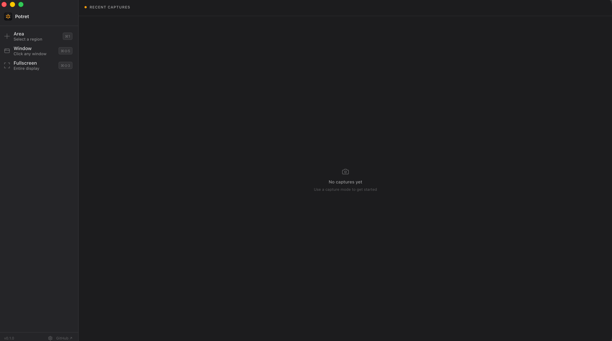

<div align="center">
  
  <h1>Potret</h1>
  <p><strong>A free, open-source screenshot & annotation tool for macOS.</strong></p>
  <p>Inspired by CleanShot X — without the price tag.</p>
  <p>
    <a href="https://tiptap.gg/dipta"></a>
  </p>
</div>

---

Potret lives in your menu bar. Take a screenshot and a floating **Quick Access** panel appears so you can copy, save, annotate, pin, drag it out, or drop it onto a beautiful background — without opening a heavy editor. Record your screen too, with click highlighting and a built-in trimmer.

## Download

### Homebrew (recommended — cleanest install)

```bash
brew install --cask PradiptaPutra/tap/potret
```

The cask strips the quarantine flag and registers the app for you, so it opens without the macOS Gatekeeper prompt (Potret is open-source and not Apple-notarized) and shows up in Launchpad. Update with `brew upgrade --cask potret`; uninstall cleanly (app **and** all its data) with `brew uninstall --zap potret`.

### Direct download (.dmg)

1. Grab the latest `.dmg` from the [**Releases**](https://github.com/PradiptaPutra/potret/releases/latest) page (universal — **Apple Silicon and Intel**).
2. Open it, drag **Potret** into **Applications** (don't run it straight from the disk image), then **eject** the disk image.

> #### ⚠️ First launch — one-time step
> Without Apple notarization, the first open is blocked with *"Apple could not verify…"* — expected for open-source apps. Either:
> - **Terminal (one command):** `xattr -dr com.apple.quarantine /Applications/Potret.app`, then open Potret.
> - **No Terminal:** double-click Potret → **Done**, then **System Settings → Privacy & Security → "Open Anyway"**.
>
> Then grant **Screen Recording** (System Settings → Privacy & Security → Screen Recording) and restart. **Potret lives in your menu bar (top-right), not the Dock.**

**Uninstall:** `brew uninstall --zap potret` (cask), or drag **Potret** from Applications to the Trash.

Prefer to build it yourself (no Gatekeeper prompt)? See [Development](#getting-started) below.

## Screenshots

<div align="center">
  
</div>

<!--
  More shots to add (capture them with Potret itself) — drop into docs/ and uncomment:
<div align="center">
  <br/>
  <br/>
  
</div>
-->

## Features

- **Capture** — area (drag to select), window (click any window), or fullscreen
- **Selection options bar** — after you drag an area, adjust it with handles, type an exact size, lock the aspect ratio, freeze the screen, or set a self-timer, then capture or record from the same bar
- **Screen recording** — area, window or fullscreen to MP4, with a countdown, an optional pointer, and **click highlighting** that marks every click in the video without showing anything on your screen
- **Trim** — review a recording on a real timeline with a ruler, drag handles to cut, and export the result as video or GIF; the trim is applied to your library, not just the exported copy
- **Quick Access popup** — copy, save, annotate, pin, or drag the capture straight into another app; follows you across Spaces/desktops
- **Annotation** — pen, line, arrow, rectangle, ellipse, text, highlighter, pixelate/blur, numbered steps, crop, eraser — with undo/redo and a custom color picker
- **Background tool** — drop a screenshot onto gradient or custom backgrounds with padding, rounded corners, and shadow (great for social posts)
- **Pin to screen** — keep a floating screenshot on top while you work
- **History** — recent captures with copy / edit / pin / delete, plus a **Recent Captures** menu-bar popup (⌘⇧H) to browse them without opening the app
- **Output options** — PNG or JPG, adjustable quality, and filename templates
- **System** — customizable global shortcuts, menu-bar only, launch at login, and fluid animations (respects Reduce Motion)

## Tech stack

- **Swift** — native macOS app, no web view
- **ScreenCaptureKit** — capture and recording
- **SwiftUI + AppKit** — system materials, controls and accent colour; Light and Dark for free
- **Swift Package Manager** — builds without Xcode

## Getting started

### Prerequisites

- macOS 14 Sonoma or later
- The Swift toolchain — either Xcode or just the Command Line Tools (`xcode-select --install`).
  The project deliberately builds without Xcode; see [`macos/TESTING.md`](macos/TESTING.md) for
  what that changes.

### Development

```bash
./macos/scripts/run.sh      # build, sign, relaunch the dev app (~10s)
./macos/scripts/test.sh     # the test suite
```

The dev build runs as `com.potret.app.dev`, so it sits alongside an installed Potret without
touching its settings or its Screen Recording grant. It needs its own grant the first time.

### Build a release (.dmg)

Releases are universal (Intel + Apple Silicon), signed with a stable self-signed identity, and
packaged with one command:

```bash
./scripts/setup-signing-cert.sh   # one-time
./scripts/release.sh              # → dist-dmg/Potret_<version>_universal.dmg
```

The stable identity matters: macOS ties the Screen Recording grant to it, so an ad-hoc-signed
build would ask every user for the permission again after every update. `release.sh` refuses to
package one.

### Permissions

Potret needs **Screen Recording** permission. On first run, grant it in
**System Settings → Privacy & Security → Screen Recording**, then restart the app.

## Project layout

```
macos/                 the app — a Swift package that builds Potret.app
  Sources/PotretCore     model, config, history, geometry — no AppKit, fully unit-tested
  Sources/PotretCapture  ScreenCaptureKit, encoding, clipboard
  Sources/PotretRender   the one renderer used on screen and for export
  Sources/PotretRecord   recording, trimming, GIF export
  Sources/PotretUI       windows, panels, editor, settings
  scripts/               build-app.sh, build-dmg.sh, run.sh, test.sh, lint-design.sh
landing/               the website (Vite + React, deployed separately)
promo/                 the promo video (Remotion, independent)
scripts/               release, signing and Homebrew publishing
```

## Support

Potret is 100% free and open-source. My Claude Code subscription, however, is **not**. 😅

This whole app was vibe-coded by an AI that bills me by the token, so every coffee
literally keeps the prompts flowing (and the developer fed). If Potret saved you the
price of a paid screenshot app, consider tossing a coin to your developer:

**[☕ Buy me a coffee — or a month of Claude Code — at tiptap.gg/dipta](https://tiptap.gg/dipta)**

Totally optional, it's free forever either way. But my token counter is judging me. 🙏

## Contributing

Contributions are welcome — see [CONTRIBUTING.md](CONTRIBUTING.md) for dev setup and the
release process. For anything substantial, please open an issue first to discuss the approach;
bug reports and small fixes can go straight to a PR.

## Status

Early but usable (v0.2), macOS only. Expect some rough edges — issues and PRs appreciated.

## License

[MIT](LICENSE)
